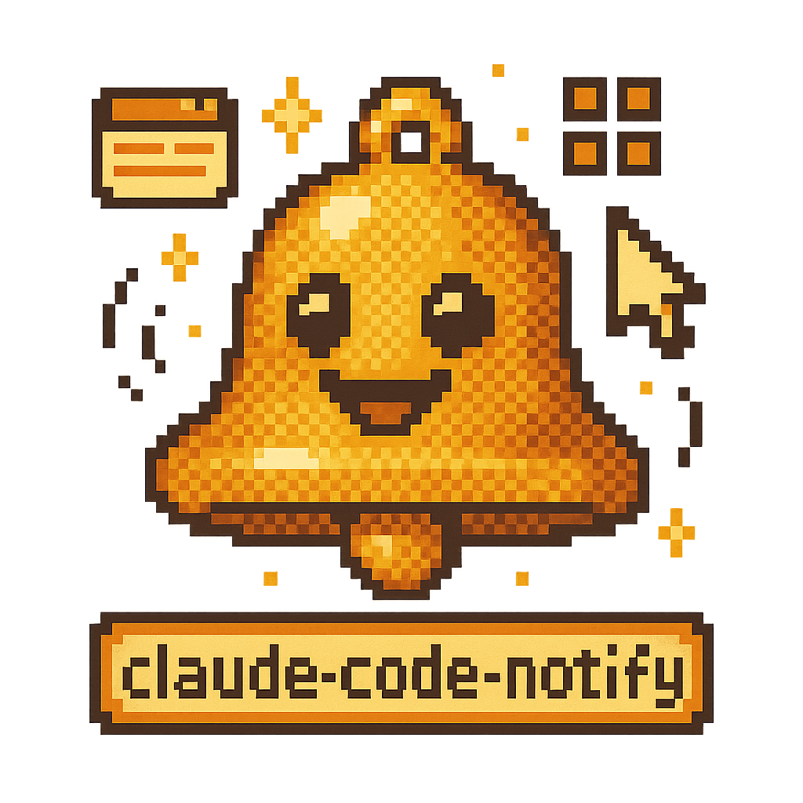

<div align="center">
  

  # agentpong

  [](https://github.com/tsilva/agentpong)
  [](https://www.apple.com/macos/sequoia/)
  [](LICENSE)
  [](https://github.com/nikitabobko/AeroSpace)

  **🏓 Your AI agent pings, you pong back — desktop notifications that jump you to the right window, even across workspaces 🔔**

  [Installation](#-installation) · [Usage](#-usage) · [How It Works](#-how-it-works) · [Troubleshooting](#-troubleshooting)
</div>

---

## Overview

**The Pain:** You run an AI coding assistant in the background while working on something else. You keep switching tabs to check if it's done — or worse, you miss a permission prompt and it sits idle for minutes.

**The Solution:** agentpong sends macOS desktop notifications the instant your AI assistant finishes a task or needs permission. One click jumps you directly to the right IDE window, even if it's buried in another workspace.

**The Result:** Zero tab-switching. Zero missed prompts. Stay in flow while your agent works.

<div align="center">

| ⚡ Setup | 🎯 Focus | 🖥️ Workspaces | 🤖 Tools |
|---------|----------|---------------|---------|
| 30 seconds | 1-click | Cross-workspace | Claude Code · OpenCode · claude-sandbox |

</div>

## ✨ Features

- **🔔 Smart notifications** — Alerts when your AI agent finishes tasks ("Ready for input") or needs permission ("Permission required")
- **🎯 Cross-workspace window focus** — Click notification to jump directly to the right Cursor/VS Code window via AeroSpace
- **🤖 Multi-tool support** — Works with Claude Code, OpenCode, and claude-sandbox containers
- **🍎 Works on Sequoia** — Uses AeroSpace instead of broken AppleScript/Hammerspoon APIs
- **⚙️ Zero config** — Install script handles everything automatically

## 📋 Requirements

- **macOS** (Sequoia 15.x supported)
- **Homebrew** for installing dependencies
- **Cursor** or **VS Code** with Claude Code or OpenCode

### Optional

- **[AeroSpace](https://github.com/nikitabobko/AeroSpace)** — Enables cross-workspace window focus when clicking notifications

## 🚀 Installation

```bash
git clone https://github.com/tsilva/agentpong.git
cd agentpong
./install.sh
```

The installer will:
1. Install `terminal-notifier` via Homebrew (if needed)
2. Copy notification and focus scripts to `~/.claude/`
3. Configure `Stop` and `PermissionRequest` hooks for Claude Code
4. Install the OpenCode plugin to `~/.config/opencode/plugins/`
5. Detect AeroSpace and enable window focus if available

### Post-install (with AeroSpace)

1. Ensure AeroSpace is running (should start automatically)
2. Grant Accessibility permissions when prompted
3. Restart your terminal/IDE

Without AeroSpace, notifications still work — clicking them will dismiss without switching to the IDE window.

## 💡 Usage

### Claude Code (Cursor / VS Code)

Notifications fire automatically after installation. Start a new Claude Code session and you'll receive alerts when:
- The agent finishes a task and is ready for input
- The agent needs permission to proceed

Click the notification to focus the IDE window.

### OpenCode

The OpenCode plugin hooks into `session.idle` and `permission.asked` events — no extra configuration needed after install. Notifications appear with "OpenCode" prefix.

### iTerm2 (Standalone Terminal)

Claude Code hooks don't fire in standalone terminals. Set up iTerm Triggers instead:

1. Open **iTerm → Settings → Profiles → Advanced → Triggers → Edit**
2. Add a new trigger:
   - **Regex:** `^[[:space:]]*>`
   - **Action:** Run Command...
   - **Parameters:** `~/.claude/notify.sh "Ready for input"`
   - **Instant:** ✓ (checked)

## 🔧 How It Works

```
┌─────────────────┐     ┌──────────────────┐     ┌──────────────────┐
│  Claude Code    │────▶│    notify.sh     │────▶│ terminal-notifier│
│  Stop Hook      │     │                  │     │                  │
└─────────────────┘     └──────────────────┘     └────────┬─────────┘
                                                          │
┌─────────────────┐     ┌──────────────────┐             │ click
│  OpenCode       │────▶│  agentpong.ts    │             ▼
│  session.idle   │     │  (plugin)        │    ┌─────────────────┐
└─────────────────┘     └──────────────────┘    │ focus-window.sh │
                                                 └────────┬────────┘
                                                          │
                                                          ▼
                                                 ┌─────────────────┐
                                                 │    AeroSpace    │
                                                 │  (focus window) │
                                                 └─────────────────┘
```

1. Hook fires (`Stop`/`PermissionRequest` for Claude Code; `session.idle`/`permission.asked` for OpenCode)
2. `notify.sh` sends a notification via `terminal-notifier` with the project workspace name
3. Clicking the notification executes `~/.claude/focus-window.sh` (if installed)
4. The focus script finds and focuses the correct IDE window via AeroSpace

### Why AeroSpace?

macOS Sequoia 15.x broke traditional window management APIs:

| Approach | Problem |
|----------|---------|
| Hammerspoon `hs.spaces.gotoSpace()` | No longer works on Sequoia |
| AppleScript `AXRaise` | Can't switch between Spaces |
| URL schemes (`cursor://`, `vscode://`) | Don't switch workspaces |
| **AeroSpace** | ✅ Works reliably without disabling SIP |

AeroSpace uses its own virtual workspace abstraction that bypasses these limitations.

## 🐳 claude-sandbox Integration

If you run Claude Code inside [claude-sandbox](https://github.com/tsilva/claude-sandbox), notifications can still reach your macOS desktop via TCP.

During installation, select "yes" when asked about sandbox support. This installs:
- A launchd service that listens on `localhost:19223`
- A container-compatible notify script that connects via `host.docker.internal`
- Hooks configured in `~/.claude-sandbox/claude-config/settings.json`

**Requirements:** claude-sandbox must have `netcat-openbsd` in its Dockerfile (included in recent versions)

```
Container                              Host (macOS)
────────────────────────────────────────────────────────────
Agent hook fires
       │
       ▼
notify.sh connects via ─────────────►  launchd TCP listener
host.docker.internal:19223                    │
                                              ▼
                                       terminal-notifier
                                       + focus-window.sh
```

## 🗑️ Uninstallation

```bash
./uninstall.sh
```

Removes notification scripts, hooks, and sandbox support (if installed). `terminal-notifier` is kept since you may use it elsewhere.

To fully remove dependencies:
```bash
brew uninstall terminal-notifier
```

## 🔍 Troubleshooting

### Notifications don't appear

1. Check that `terminal-notifier` is installed: `which terminal-notifier`
2. Verify the hook is configured: `cat ~/.claude/settings.json | grep Stop`
3. Test manually: `~/.claude/notify.sh "Test"`

### Clicking notification doesn't focus the window

1. Check focus-window.sh is installed: `ls -la ~/.claude/focus-window.sh`
2. Check AeroSpace is installed: `which aerospace` or `ls /opt/homebrew/bin/aerospace`
3. Check AeroSpace is running: `pgrep -x AeroSpace`
4. Check Accessibility permissions: **System Settings → Privacy & Security → Accessibility**
5. Test window listing: `aerospace list-windows --all | grep Cursor`
6. Test focus script directly: `~/.claude/focus-window.sh "your-project-name"`

### Hooks don't fire

Claude Code and OpenCode hooks only work in IDE-integrated terminals (Cursor/VS Code). For standalone terminals like iTerm2, use the Triggers workaround described in [Usage](#-usage).

## 🤝 Contributing

Contributions welcome! Feel free to [open an issue](https://github.com/tsilva/agentpong/issues) or submit a pull request.

## 📄 License

[MIT](LICENSE)

---

<div align="center">

Found this useful? [⭐ Star the repo](https://github.com/tsilva/agentpong) to help others discover it!

</div>
