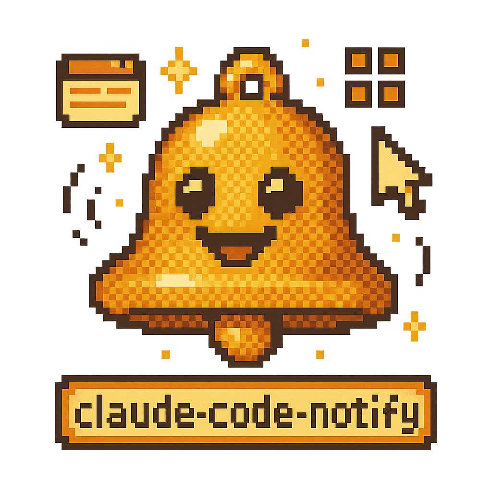
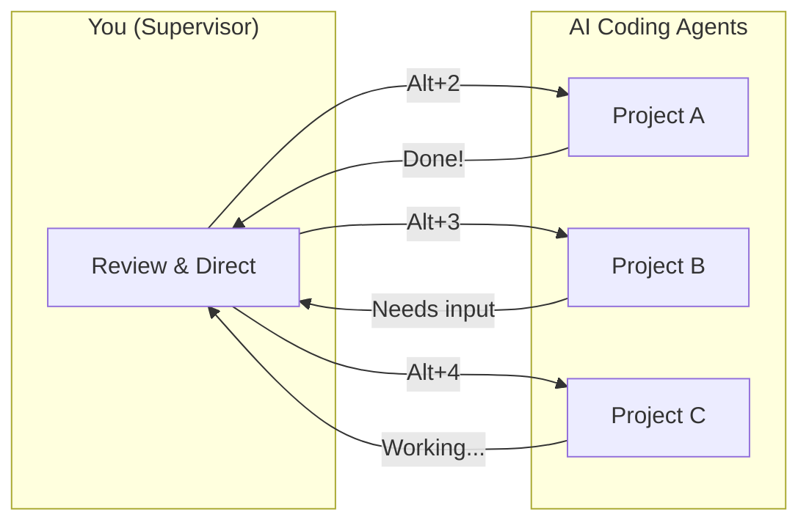

<div align="center">
  

  # agentpong

  [](https://github.com/tsilva/agentpong)
  [](https://www.apple.com/macos/sequoia/)
  [](https://github.com/nikitabobko/AeroSpace)
  [](LICENSE)

  **🎛️ Supervise multiple AI coding agents in parallel — organized workspaces, instant switching, desktop notifications 🏓**

  [Quick Start](#-quick-start) · [Supervisor Pattern](#-the-supervisor-pattern) · [Features](#-features) · [Ecosystem](#-ecosystem) · [Installation](#-installation) · [Usage](#-usage) · [How It Works](#-how-it-works) · [Troubleshooting](#-troubleshooting)
</div>

---

## 🚀 Quick Start

Install with one command:

```bash
curl -fsSL https://raw.githubusercontent.com/tsilva/agentpong/main/install.sh | bash
```

The installer will:
1. Install AeroSpace, terminal-notifier, and jq (if needed)
2. Deploy AeroSpace config with workspace keybindings
3. Install scripts for window organization and notification handling
4. Configure AI agent hooks (Claude Code, Codex CLI, OpenCode)
5. Optionally install Alfred workflow and sandbox support

---

## Overview

**The Pain:** Running one AI coding agent session is straightforward. Running *several* in parallel — each working on a different project — quickly becomes chaos. Which task finished? Which window was that? You keep switching tabs to check, or worse, you miss a permission prompt and an agent sits idle for minutes.

**The Solution:** agentpong turns you into a **supervisor of AI coding agents**. Your Cursor windows get organized into numbered workspaces by priority. When an agent finishes or needs permission, you get a desktop notification. One click (or `alt+n`) jumps you directly to the right window — even across workspaces.

**The Result:** Zero tab-switching. Zero missed prompts. Organized workspaces. Instead of babysitting one session, you delegate tasks, switch away, and return when notified. This is the supervisor pattern.

<div align="center">

| ⚡ Setup | 🎯 Focus | 🖥️ Workspaces | 🤖 Tools |
|---------|----------|---------------|---------|
| 30 seconds | 1-click or alt+n | Cross-workspace | Claude Code · Codex CLI · OpenCode · claude-sandbox |

</div>

## 🎛️ The Supervisor Pattern


```mermaid
graph LR
    subgraph You["You (Supervisor)"]
        Review["Review & Direct"]
    end

    subgraph Agents["AI Coding Agents"]
        A1["Project A"]
        A2["Project B"]
        A3["Project C"]
    end

    Review -->|"Alt+2"| A1
    Review -->|"Alt+3"| A2
    Review -->|"Alt+4"| A3

    A1 -->|"Done!"| Review
    A2 -->|"Needs input"| Review
    A3 -->|"Working..."| Review
```

1. **Delegate** — Give your AI agent a task and switch away (`alt+3` to Project B)
2. **Multiplex** — Work on another project while the first one runs
3. **Get notified** — Desktop alert when Claude finishes or needs permission
4. **Context switch** — Click notification or press `alt+2` to jump back instantly
5. **Review & repeat** — Check output, give next task, switch to another project

This turns waiting time into productive time. While an agent thinks through a complex refactor in Project A, you're reviewing changes in Project B and delegating tests in Project C.

### What Are Workspaces?

Workspaces are virtual desktops managed by [AeroSpace](https://github.com/nikitabobko/AeroSpace), a tiling window manager for macOS. They're similar to macOS Spaces but with key differences:

- **Instant switching** — No slide animations; workspaces change immediately
- **Keyboard-driven** — `alt+1` through `alt+9` switches directly to any workspace
- **One app per workspace** — Each AI agent instance gets its own dedicated space
- **Fullscreen by default** — Every window is maximized, zero distractions

This is what makes the supervisor pattern practical — switching between projects takes milliseconds, not seconds.

### Workspace Layout

| Workspace | Keybinding | Purpose |
|-----------|------------|---------|
| 1 | `alt+1` | Browser, notes, documentation |
| 2-9 | `alt+2` - `alt+9` | One Cursor window per workspace (each running an AI coding agent) |

High-priority projects get lower numbers for faster access.

## ✨ Features

- **🖥️ Workspace management** — AeroSpace-powered numbered workspaces with `alt+1..9` switching
- **📋 Window organization** — Press `alt+s` to sort Cursor windows into numbered workspaces
- **🔔 Smart notifications** — Alerts when AI agents finish tasks or need permission
- **🎯 Cross-workspace focus** — Click notification or press `alt+n` to jump to the right window
- **🔍 Project switcher** — Alfred workflow (`alt+p`) to search and switch between projects
- **⚡ Performance tuning** — Optional macOS animation disabling for snappier workspace switching
- **🤖 Multi-tool support** — Claude Code, Codex CLI, OpenCode, and claude-sandbox containers

## 📋 Example Session

Supervising three projects in parallel:

1. **`alt+2`** — Open my-api-backend: "Add pagination to the /users endpoint"
2. **`alt+3`** — Switch to my-web-frontend: "Update the user list component to handle paginated responses"
3. **`alt+4`** — Switch to my-mobile-app: "Write unit tests for the login flow"
4. **Desktop notification:** "my-api-backend — Ready for input" — **click** to jump back
5. **`alt+2`** — Review the pagination changes, then: "Now add rate limiting to that endpoint"
6. **`alt+n`** — Another notification pending — jump to my-mobile-app to review tests
7. **Repeat** — delegate, switch, review, delegate

## 🧩 Ecosystem

agentpong is the core of a broader workflow. These companion projects enhance the supervisor pattern:

### Tightly Integrated

| Project | Description |
|---------|-------------|
| [claudebox](https://github.com/tsilva/claudebox) | Sandboxed Claude Code execution — full autonomy, no permission prompts |

### Optional Workflow Enhancers

| Project | Description |
|---------|-------------|
| [capture](https://github.com/tsilva/capture) | Instant thought capture to Gmail — dump ideas without breaking flow |
| [claudebridge](https://github.com/tsilva/claudebridge) | OpenAI-compatible API bridge for Claude Max subscriptions |

## 📋 Requirements

- **macOS** (Sequoia 15.x supported)
- **Homebrew** for installing dependencies
- **Cursor** for the full workspace-management flow
- A **terminal** with Claude Code, Codex CLI, or OpenCode for notification-only workflows

### Installed Automatically

- **[AeroSpace](https://github.com/nikitabobko/AeroSpace)** — Tiling window manager for workspace management and cross-workspace focus (core requirement)
- **[terminal-notifier](https://github.com/julienXX/terminal-notifier)** — macOS desktop notifications
- **[jq](https://jqlang.github.io/jq/)** — JSON processor for settings configuration

### Optional

- **[Alfred](https://www.alfredapp.com/)** — Project switcher workflow (detected automatically, never required)

## 🚀 Installation

### Quick Install (Recommended)

```bash
curl -fsSL https://raw.githubusercontent.com/tsilva/agentpong/main/install.sh | bash
```

**Security-conscious?** Download first to inspect:
```bash
curl -fsSL -o install-agentpong.sh https://raw.githubusercontent.com/tsilva/agentpong/main/install.sh
# Review the script...
bash install-agentpong.sh
```

### Development / Manual Install

```bash
git clone https://github.com/tsilva/agentpong.git
cd agentpong
./install.sh
```

### Installer Flags

```
--dry-run          Preview all changes without applying them
--update           Only update changed files, skip all prompts
--force, -f        Force reinstall even if already up to date
--quiet, -q        Minimal output (for CI/automation)
--verbose, -v      Maximum output with debug logging
--wizard, -w       Interactive TUI configuration mode
--health-check     Run post-install verification only
--uninstall        Remove agentpong completely
```

### Reinstalling / Updating

Run the install command again. The installer is **idempotent** — it skips unchanged files and only updates what's needed.

Force a complete reinstall:
```bash
curl -fsSL https://raw.githubusercontent.com/tsilva/agentpong/main/install.sh | bash -s -- --force
```

### Post-install

1. AeroSpace should start automatically (configured with `start-at-login = true`)
2. Grant Accessibility permissions when prompted
3. Press `alt+s` to organize your Cursor windows

## 💡 Usage

### Keybindings

| Shortcut | Action |
|----------|--------|
| `alt+1..9` | Switch to workspace 1-9 |
| `alt+shift+1..9` | Move window to workspace 1-9 |
| `alt+s` | Sort/organize Cursor windows |
| `alt+n` | Focus next pending notification |
| `alt+p` | Open project switcher (Alfred) |
| `alt+f` | Toggle fullscreen |
| `alt+left/right` | Previous/next workspace |

### Claude Code

Notifications fire automatically after installation. Start a new Claude Code session and you'll receive alerts when:
- The agent finishes a task and is ready for input
- The agent needs permission to proceed

Click the notification to focus the Cursor window.

### OpenCode

The OpenCode plugin hooks into `session.idle` and permission-request events with no extra configuration after install. Notifications appear with the "OpenCode" prefix.

### Codex CLI

The Codex CLI plugin handles `agent-turn-complete` events via a Python script. After installation, add the notification hook to your Codex config:

```toml
# ~/.codex/config.toml
notify = ["python3", "~/.codex/agentpong.py"]
```

Notifications appear with "Codex" prefix. Codex CLI currently only supports task-completion notifications (no permission hooks).

### Alfred Project Switcher

Press `alt+p` to open the project switcher. It shows:
- **Open projects** first, sorted by workspace number
- **Unopened repos** alphabetically, with option to open in Cursor

Set `AGENTPONG_REPOS_DIR` to customize the repo scan path (default: `~/repos`).

### iTerm2 (Standalone Terminal)

Claude Code hooks don't fire in standalone terminals. Set up iTerm Triggers instead:

1. Open **iTerm > Settings > Profiles > Advanced > Triggers > Edit**
2. Add a new trigger:
   - **Regex:** `^[[:space:]]*>`
   - **Action:** Run Command...
   - **Parameters:** `~/.claude/notify.sh "Ready for input"`
   - **Instant:** checked

## 🔧 How It Works

```
┌─────────────────┐     ┌──────────────────┐     ┌──────────────────┐
│  Claude Code    │────▶│    notify.sh     │────▶│ terminal-notifier│
│  Stop Hook      │     │                  │     │                  │
└─────────────────┘     └──────────────────┘     └────────┬─────────┘
                                                          │
┌─────────────────┐     ┌──────────────────┐             │ click
│  Codex CLI      │────▶│  agentpong.py    │             ▼
│  notify hook    │     │  (plugin)        │    ┌─────────────────┐
└─────────────────┘     └──────────────────┘    │ focus-window.sh │
                                                 └────────┬────────┘
┌─────────────────┐     ┌──────────────────┐             │
│  OpenCode       │────▶│  agentpong.ts    │             ▼
│  session.idle   │     │  (plugin)        │    ┌─────────────────┐
└─────────────────┘     └──────────────────┘    │    AeroSpace    │
                                                 │  (focus window) │
                                                 └─────────────────┘
```

### Notification Flow

1. Hook fires (`Stop`/`PermissionRequest` for Claude Code; `agent-turn-complete` for Codex CLI; `session.idle` plus permission-request events for OpenCode)
2. `notify.sh` sends a notification via `terminal-notifier` with the project workspace name
3. Clicking the notification executes `focus-window.sh`
4. The focus script finds and focuses the correct IDE window via AeroSpace

### Workspace Management Flow

1. `aerospace.toml` defines keybindings and auto-assigns apps to workspaces
2. `alt+s` triggers `sort-workspaces.sh` which:
   - Unminimizes all Cursor windows
   - Moves windows to numbered workspaces (starting at 2)

### Why AeroSpace?

macOS Sequoia 15.x broke traditional window management APIs:

| Approach | Problem |
|----------|---------|
| Hammerspoon `hs.spaces.gotoSpace()` | No longer works on Sequoia |
| AppleScript `AXRaise` | Can't switch between Spaces |
| URL schemes (`cursor://`, `vscode://`) | Don't switch workspaces |
| **AeroSpace** | Works reliably without disabling SIP |

AeroSpace uses its own virtual workspace abstraction that bypasses these limitations.

## 🐳 claude-sandbox Integration

If you run Claude Code inside [claudebox](https://github.com/tsilva/claudebox), notifications can still reach your macOS desktop via TCP.

During installation, select "yes" when asked about sandbox support. This installs:
- A launchd service that listens on port `19223` and requires a local shared token
- A container-compatible notify script that connects via `host.docker.internal`
- Hooks configured in `~/.claude-sandbox/claude-config/settings.json`

```
Container                              Host (macOS)
────────────────────────────────────────────────────────────
Agent hook fires
       │
       ▼
notify.sh connects via ─────────────►  launchd TCP listener
host.docker.internal:19223                    │
                                              ▼
                                       terminal-notifier
                                       + focus-window.sh
```

## 🗑️ Uninstallation

One-line uninstall:
```bash
curl -fsSL https://raw.githubusercontent.com/tsilva/agentpong/main/uninstall.sh | bash
```

Or if you have the repo cloned locally:
```bash
./uninstall.sh
```

This removes:
- Notification scripts and hooks
- AeroSpace scripts from `~/.config/aerospace/`
- `~/.aerospace.toml` (with prompt, since you may have customized it)
- Alfred workflow (if installed)
- Re-enables macOS animations
- OpenCode plugin, Codex CLI plugin, and sandbox support (if installed)

AeroSpace itself is **not** removed. To uninstall it: `brew uninstall aerospace`

To fully remove other dependencies:
```bash
brew uninstall terminal-notifier
```

## 🔍 Troubleshooting

### Notifications don't appear

1. Check that `terminal-notifier` is installed: `which terminal-notifier`
2. Verify the hook is configured: `cat ~/.claude/settings.json | grep Stop`
3. Test manually: `~/.claude/notify.sh "Test"`

### Clicking notification doesn't focus the window

1. Check AeroSpace is installed: `which aerospace` or `ls /opt/homebrew/bin/aerospace`
2. Check AeroSpace is running: `pgrep -x AeroSpace`
3. Check Accessibility permissions: **System Settings > Privacy & Security > Accessibility**
4. Test window listing: `aerospace list-windows --all | grep Cursor`
5. Test focus script: `~/.claude/focus-window.sh "your-project-name"`

### alt+s doesn't organize windows

1. Check scripts are installed: `ls ~/.config/aerospace/sort-workspaces.sh`
2. Check AeroSpace config is loaded: `aerospace reload-config`

### Hooks don't fire

Claude Code and OpenCode hooks are supported in Cursor. Codex CLI hooks work in any terminal. For standalone terminals running Claude Code, use the iTerm Triggers workaround described in [Usage](#-usage).

### Run health check

```bash
./install.sh --health-check
```

## 🤝 Contributing

Contributions welcome! Feel free to [open an issue](https://github.com/tsilva/agentpong/issues) or submit a pull request.

## 📄 License

[MIT](LICENSE)

---

<div align="center">

Found this useful? [⭐ Star the repo](https://github.com/tsilva/agentpong) to help others discover it!

</div>
