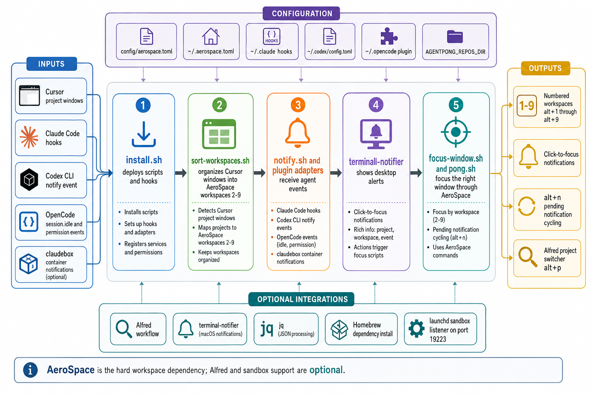

<p align="center">
  
  <br />
  <!-- repo-tagline:start -->
  <strong>🎛️ Supervise AI coding agents across organized workspaces 🏓</strong>
  <!-- repo-tagline:end -->
</p>

agentpong is a macOS workspace for supervising several AI coding agents at once. It uses AeroSpace to keep Cursor project windows in numbered workspaces, then sends desktop notifications when Claude Code, Codex CLI, OpenCode, or Kimi Code finishes or needs attention.

Click a notification, or press `alt+n`, to jump back to the correct project window across workspaces.

## Install

```bash
curl -fsSL https://raw.githubusercontent.com/tsilva/agentpong/main/install.sh | bash
```

After installation, grant macOS Accessibility permissions when prompted, open the Cursor windows you want to supervise, then press `alt+s` to sort them into workspaces.

Interactive installs show a multi-select picker (powered by [gum](https://github.com/charmbracelet/gum) when available) so you can choose which agents to hook into — Claude Code, Codex CLI, OpenCode, Kimi Code — plus optional claude-sandbox and Alfred integrations. Detected agents are pre-selected.

For a local install:

```bash
git clone https://github.com/tsilva/agentpong.git
cd agentpong
./install.sh
```

## Commands

```bash
./install.sh --dry-run       # preview install changes
./install.sh --wizard        # run interactive configuration
./install.sh --health-check  # verify installed scripts and dependencies
./install.sh --force         # reinstall even if files are up to date
./uninstall.sh               # remove agentpong scripts and hooks
```

## Usage

```bash
alt+1..9          # switch to workspace 1-9
alt+shift+1..9    # move current window to workspace 1-9
alt+s             # organize Cursor windows into workspaces 2-9
alt+n             # focus the next pending agent notification
alt+p             # open the Alfred project switcher, when Alfred is installed
alt+f             # toggle fullscreen
alt+left/right    # move to previous or next workspace
```

Codex CLI and Kimi Code hooks are written into their `config.toml` files automatically (marker-delimited blocks, removed again on uninstall). Codex only supports a turn-complete event — there is no permission notification for Codex.

`./uninstall.sh` is selective: it shows the same multi-select picker (everything installed pre-selected) so you can remove just one agent's integration instead of everything.

## Notes

- macOS and Homebrew are expected. AeroSpace is required for workspace switching and cross-workspace focus.
- The installer installs or configures `terminal-notifier`, `jq`, AeroSpace config, notification scripts, agent hooks, and optional Alfred or claudebox support. `gum` is an optional dependency that enables the richer multi-select TUI; a text fallback is built in.
- Cursor is the supported editor for the full workspace-management flow.
- Alfred is optional. When installed, `alt+p` lists open projects first and unopened repos after them.
- `AGENTPONG_REPOS_DIR` overrides the default Alfred repo scan directory of `~/repos`.
- claudebox support uses a launchd listener on local port `19223` with a shared token.
- AeroSpace itself is not removed by `./uninstall.sh`; remove it separately with Homebrew if needed.

## Architecture



## License

[MIT](LICENSE)
